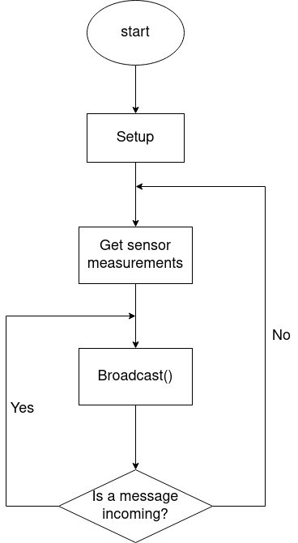
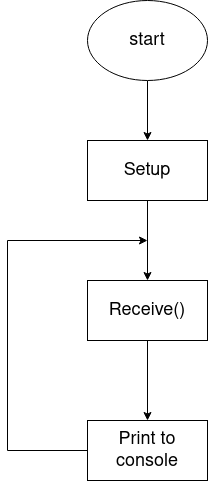

3 - Project Overview / Scenario

## Project and Scenario Description 

## Key Performance Indicators
### How is the ’success’ of the project measured?

* **KPI1: Bluetooth Communications**
    - Bluetooth Low Energy Mesh network set up
    - Appropriate packet structure for sending and receiving data 
    - Messaging protocol 
    - Handles exceptions and errors (edge cases) (e.g. weather station dropping out, base being disconnect etc.)
    - At least 2 mobile nodes / scalable setup 
* **KPI2: Power Management**
    - Ensure weather station node can be powered sustainably
    - Set sampling rate of sensors (configure duty cycle)
    - Efficient code so that minimal instructions are executed to conserve power 
    - Connected to solar charging battery 
* **KPI3: Sensor Integration**
    - Receive weather and air quality readings from Thingy:52 / Argon (Temperature, humidity, air pressure, CO2 and VOC levels)
    - Validate the accuracy of readings 
* **KPI4: Web Dashboard**
    - Interactive Graphical User Interface
    - Basic statistical analysis of data collected
    - Validation with other data sources (BOM)
    
* **KPI5: Techniques/methods from lectures are used**
    - Localisation
    - Mobility, tracking
    - Time synchronization
    - Sensing, signal processing
    - Machine Learning for weather prediction (storm predicted in next 24 hours?)
    - Other 

## System Overview
### (Hardware Architecture - block diagram of system, Top-level flow chart of software implementation (mote and PC)

0. Hardware Block Diagram. 

    .png)
    

1. Mobile flowchart. 

    
    
2. Base flowchart. 
    
    
    
    
3. PC flowchart. 

    .drawio.png)
    
    

## Sensor Integration 
The sensors that will be used in this project are the following: 
* HTS221 for temperature and humidity readings
* LPS22HB for Air Pressure readings
* CCS811 for CO2 and TVOC readings 

All of the sensor data will be stored as floats for decimal precision. All of the sensors used are onboard the Thingy:52 and are accessed in code through devicetree keybindings in their drivers. 

## Wireless Network Communication
### What is the network topology used? What network protocols are used and how? What is sort of data rate is required? Should also include a message protocol diagram.

## Algorithms schemes used
### e.g. Machine learning approaches

### Possible Extensions

* Extending the mesh network to include an arbitrary number of weather station mobile nodes 
* Data collection for possible machine learning prediction of weather patterns
* Validate data collected from official meteorological data 
* Incorporate ranging and localisation to time stamp and location stamp weather station readings (Kalman Filter?)
* Solar panel charging (with power management / duty cycle)