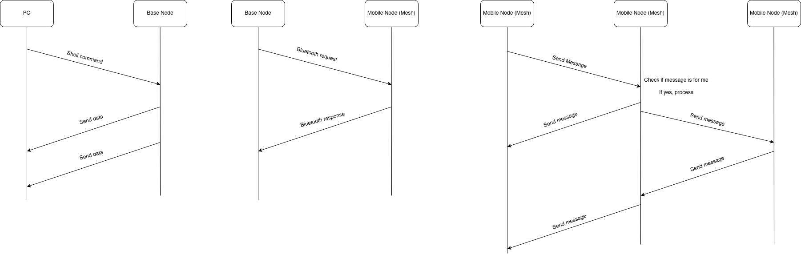

# Project Overview / Scenario

## Project and Scenario Description 

Project B1 - Outdoor Air Quality and Weather Station Network 
* Expand	your	prac 1	and	create	a	network	of atleast	2 air	quality	
monitoring	sensors	using	the	Thingy:52 or	Argon and	the	SEN54.
*  The	stations	should	communicate	with	each	other	and	a	base	node	via	a	
Bluetooth	Mesh	connection. Mesh	network	connection	must	be	shown	to	
work.
* Have	a	web	dashboard	viewer.

## Key Performance Indicators
### How is the ’success’ of the project measured?

1.  **Bluetooth Communications**
    - Bluetooth Low Energy Mesh network set up & sending messages
    - Handles exceptions and errors (edge cases) (e.g. weather station dropping out, base being disconnect etc.)
    - At least 2 mobile nodes / scalable setup
2.  **Power Management**
    - Ensure weather station node can be powered sustainably (with the use of a solarpanel and LiPo batteries)
    - Be able to set the sampling rate of sensors (configure duty cycle)
    - Efficient code so that minimal instructions are executed to conserve power
3.  **Sensor Integration**
    - Receive weather and air quality readings from Thingy:52 / Argon (Temperature, humidity, air pressure, CO2 and VOC levels)
    - Validate the accuracy of readings
4.  **Web Dashboard**
    - Interactive Graphical User Interface
    - Basic statistical analysis of data collected
    - Validation with other data sources (BOM)
    
5.  **Techniques/methods from lectures are used**
    - Localisation
    - Mobility, tracking
    - Time synchronization
    - Sensing, signal processing
    - Machine Learning for weather prediction (storm predicted in next 24 hours?)
    - Other 

## System Overview
### (Hardware Architecture - block diagram of system, Top-level flow chart of software implementation (mote and PC)

0. Hardware Block Diagram. 

    
    

1. Mobile flowchart. 

    
    
2. Base flowchart. 
    
    
    
    
3. PC flowchart. 

    
    
    

## Sensor Integration 
The sensors that will be used in this project are the following: 
* HTS221 for temperature and humidity readings
* LPS22HB for Air Pressure readings
* CCS811 for CO2 and TVOC readings 

All of the sensor data will be stored as floats for decimal precision. All of the sensors used are onboard the Thingy:52 and are accessed in code through devicetree keybindings in their drivers. 

## Wireless Network Communication

* nrf Dongle will join the mesh network as a Proxy Node. This way it will be able to connect to the Thingy:52s and send information to Python listener script for web dashboard stuff 

* Mobile nodes, specifically Thingy:52 devices, will connect to each other via the Bluetooth Low Energy Mesh network. 

## Algorithms schemes used
### e.g. Machine learning approaches

Need to investigate the operation of Bluetooth mesh nodes. Rough outline of how it works: 

* When a node receives a packet, check if it has received the packet already; if so discared. Else, check if this node is the packet's destination. If so, process the packet. Else, propogate the packet through the network (until it reaches its intended destination)

* Mobile Nodes in range of the base node (i.e. node connected to the PC), will broadcast messages to the PC node. PC connected node will then follow a similar scheme to as described above. 

### Possible Extensions

* Extending the mesh network to include an arbitrary number of weather station mobile nodes 
* Data collection for possible machine learning prediction of weather patterns
* Validate data collected from official meteorological data 
* Incorporate ranging and localisation to time stamp and location stamp weather station readings (Kalman Filter?)
* Solar panel charging (with power management / duty cycle)
