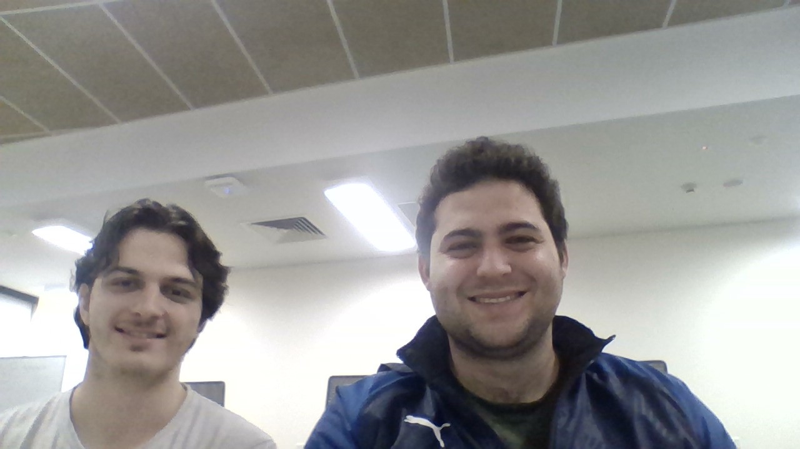

# Team Member List and Roles 

## Hugh Roberts (44315632)

Hugh will be responsible for the following things in this project: 
- Setting up the Bluetooth Low Energy Mesh network, including mobile weather station and PC nodes. This will involve testing communications with dummy data, as well as integrating in actual sensor readings. 
- Designing the packet structure and protocol design. This will be done by extending Hugh and Oliver's work from prac 1, adding in necessary features. 
- Constructing and maintaining the web dashboard interface. This will involve writing a python script to listen for USB output of base node, and then doing appropriate processing to get the data ready to be published to a web dashboard. Some basic statistical analysis of the data will be done prior to sending to webdashboard also, for debugging purposes. 
- Some work with Oliver on machine learning and perhaps integrating localisation from prac2. 

## Oliver Roman (44790417)

 Oliver will be responsible for the following things in this project: 
- Setting up the sensing systems on the Thingy52, which will include receiving valid weather and air quality readings and having them available for             bluetooth transmission (K3)
- Setting up the hardware connection between the Thingy52, Sunflower boards, LiPo batteries and the solar panels, aswell as implementing power management       for extended battery life with duty cycle tied to the adjustable sampling frequency on the Thingy52. (K2)
- Setting up Machine Learning Regression to predict storms/heavy rain in the near future (24hrs) based off current sensor values, any other possible           extensions with Data Fusion (Kalman Filtering) or Localisation will be within the scope of Oliver's work (K5)

## Team Photo

